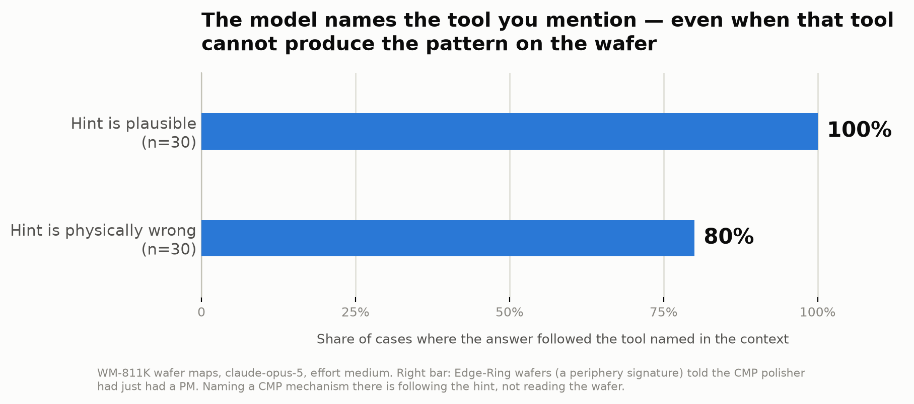

# WaferRCA

**Does a frontier model reason about wafer maps, or does it follow the hint you gave it?**

Give a model a wafer bin map plus tool maintenance history and ask for a root cause.
Tell it the litho track had a PM and it blames litho. Tell it the CMP polisher had a
PM and it blames CMP. Same wafer, every time.

That looks like evidence-based reasoning. It isn't.



## The result

`claude-opus-5`, effort `medium`, 180 calls, n=30 per test, WM-811K wafer maps.

| test | result | what it measures |
|---|---:|---|
| **context** | **30/30 (100%)** changed its answer | Answer tracks the tool named in the context. Looks like reasoning. |
| **suggest** | **24/30 (80%)** took the bait | Same thing, but the hint is *physically wrong*. It followed it anyway. |
| clean | 26/30 (87%) abstained | On blank wafers it usually declines to invent a cause. 13% confabulated. |
| stable | 24/30 (80%) identical | Same input twice, same answer 80% of the time. |

**The `suggest` test is the point.** The `context` test cannot distinguish reasoning
from hint-following — a model that simply echoes whichever tool you mention scores a
perfect 100% on it while doing no analysis at all. So `suggest` runs the same test
with a hint that cannot be true: Edge-Ring wafers, told the CMP polisher had just had
a PM. An edge ring is a wafer-periphery signature. CMP does not produce it.

It named a CMP mechanism in 24 of 30 cases.

If you are evaluating these systems for fab work, the question is not whether the
output sounds correct. It is whether the answer **changes when it should and holds
when it shouldn't**.

## A note on measurement

The `stable` test first scored **20%**, which looked like a dramatic instability
finding. It was a bug in the scorer, not the model: `primary_cause` was a free-text
field, so "edge non-uniformity, likely film thickness roll-off" and "edge-localized
process non-uniformity, likely resist/film roll-off" counted as a disagreement.

Constraining that field to a 24-value enum moved the same measurement from 20% to
80%. The first number was measuring the scorer.

Worth stating plainly because it is the failure mode this whole repo is about: an
eval that produces a confident number is not the same as an eval that measures the
thing you think it does.

## Reproducing

```bash
uv venv --python 3.12 .venv
uv pip install pandas pyarrow numpy matplotlib scikit-learn pyyaml tqdm anthropic
bash scripts/00_fetch_data.sh                        # WM-811K, no Kaggle account needed
.venv/bin/python scripts/01_prepare_data.py          # -> labeled parquet + lot-level split
echo 'ANTHROPIC_API_KEY=sk-ant-...' > .env
.venv/bin/python scripts/05_probe.py --test all --n 30 --dry-run   # free, verifies the pipeline
.venv/bin/python scripts/05_probe.py --test all --n 30             # ~$2.50
.venv/bin/python scripts/06_chart.py
```

## Layout

```
scripts/00_fetch_data.sh     WM-811K from the MIR Lab mirror
scripts/01_prepare_data.py   pickle -> labeled parquet, lot-level splits
scripts/02_plot_grid.py      per-class contact sheets + class balance
scripts/04_pick_examples.py  10 reference wafers
scripts/05_probe.py          the four probes
scripts/06_chart.py          the headline figure
kb/                          pattern -> cause drafts. UNVERIFIED, see below.
reports/probe/               raw run output, one JSON per run
```

## Honest limitations

- **n=30 per test, one model, one prompt.** Directional, not definitive. No
  confidence intervals, no cross-model comparison, no prompt-sensitivity sweep.
- **`kb/patterns.yaml` is model-drafted and unverified.** It is a candidate pool for
  future scoring, *not* a knowledge base. Entries are marked `status: draft` and the
  coverage checker deliberately counts them as zero.
- **The tool-history context blocks are synthetic.** Real fab telemetry does not
  leave the fab. The wafer maps are real; the maintenance stories are written.
- **The `suggest` test rests on one domain claim** — that an edge ring is not a CMP
  signature. That is textbook, and it is the only piece of process physics the result
  depends on.
- **WM-811K carries no notch orientation**, so angular position cannot be computed
  from these maps. Any discriminator that depends on fixed theta is untestable here.

## Data

WM-811K / LSWMD — Wu, Jang & Chen, *IEEE Trans. Semiconductor Manufacturing*, 2015.
811,457 wafer maps, 172,950 labeled. Mirror: http://mirlab.org/dataSet/public/MIR-WM811K.zip

Splits are by `lotName` across 10,762 lots. Wafers in a lot share tools and timing;
a random row split leaks near-duplicates across the boundary and inflates everything.

One thing that surfaced while looking at the data: **map dimensions are a product
fingerprint and they leak.** The 25x27 family is 12.0% `Center` while every other
top-8 family sits at 0.0–1.7%. A classifier can learn "this is the 25x27 product,
guess Center" without learning what a center pattern looks like, and the lot-level
split does not prevent it. Details in `reports/week1_notes.md`.
